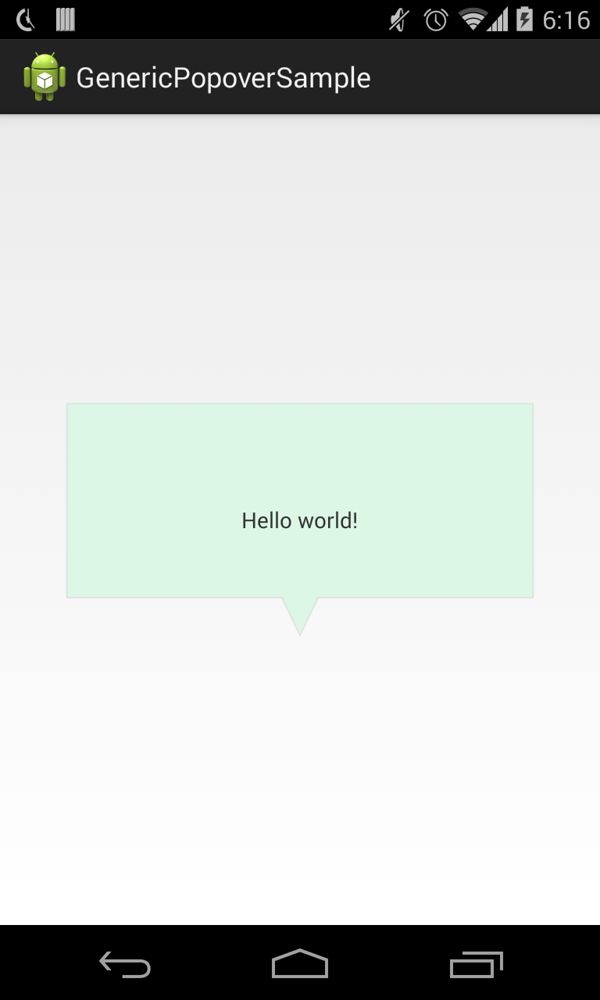

GenericPopoverDrawable
======================

A generic popover drawable for Android views.

### Installation 
* Copy popover folder as a module to your project
* Add **include ':popover'** in your settings.gradle

### Code Sample 
```java
    @Override
    protected void onCreate(Bundle savedInstanceState) {
        super.onCreate(savedInstanceState);
        setContentView(R.layout.activity_main);

        int backgroundColor = getResources().getColor(R.color.popover_background);
        int borderColor = getResources().getColor(R.color.popover_border);

        GenericPopoverDrawable popoverDrawable = new GenericPopoverDrawable(backgroundColor, borderColor);
        findViewById(R.id.popover_button).setBackground(popoverDrawable);
    }
```



